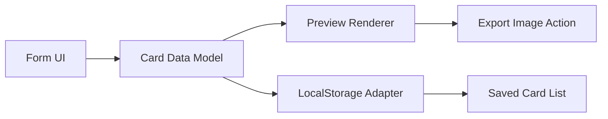

# Design Document Template

---
**Purpose**: Provide sufficient detail to ensure implementation consistency across different implementers, preventing interpretation drift.

**Approach**:
- Include essential sections that directly inform implementation decisions
- Omit optional sections unless critical to preventing implementation errors
- Match detail level to feature complexity
- Use diagrams and tables over lengthy prose

**Warning**: Approaching 1000 lines indicates excessive feature complexity that may require design simplification or splitting into multiple specs.
---

> Sections may be reordered (e.g., surfacing Requirements Traceability earlier or moving Data Models nearer Architecture) when it improves clarity. Within each section, keep the flow **Summary → Scope → Decisions → Impacts/Risks** so reviewers can scan consistently.

## Overview
This feature delivers a static interactive web experience for creating and managing business cards. Users can enter data, see a live business card preview, and persist business cards locally in the browser as cards are created, edited, or deleted.

**Purpose**: This feature delivers a dependency-free card generation and management workflow for independent professionals.
**Users**: Independent professionals and small business owners will utilize this for creating digital business cards and maintaining a local card collection.
**Impact**: Changes the current static front-end implementation by introducing a form-driven authoring workflow, visual theme and layout controls, and a LocalStorage-backed persistence model.

### Goals
- Allow users to submit complete professional card information using a creation form.
- Show a dynamic preview that updates as the form changes.
- Persist cards locally and support simple management operations such as list, edit, and delete.
- Keep implementation in plain HTML, CSS, and JavaScript without package or framework installation.

### Non-Goals
- User authentication or account management.
- Backend or cloud storage.
- Server-side card sharing or email delivery.
- Importing cards from external databases.

## Boundary Commitments

### This Spec Owns
- Authoring UI for card fields: name, job title, email, social links, and visual theme.
- Card preview rendering and layout/color customization behavior.
- LocalStorage-backed storage contract for saved cards.
- Form validation behavior and business error states.

### Out of Boundary
- Authentication and account policies.
- Cross-device synchronization.
- Export to file formats other than an image or download artifact.
- Analytics and personalization services.

### Allowed Dependencies
- Browser LocalStorage API.
- DOM APIs for rendering and dynamic preview updates.
- Optional canvas API for exporting the preview card as an image.

### Revalidation Triggers
- Changes to field schema or saved card data shape.
- Changes to the LocalStorage key contract.
- Changes in card preview layout or visual theme model.
- Changes to validation requirements or social-link format requirements.

## Architecture

### Existing Architecture Analysis
The project starts as a static HTML, CSS, and JavaScript experience. The design should preserve the simple static boundary and avoid introducing a framework or package manager because the requirement scope is tightly focused on one front-end webpage.

### Architecture Pattern & Boundary Map
The application can be organized as a static single-page UI with three core responsibilities: data capture form, preview renderer, and local data manager. A simple responsibility map is:

**Architecture Integration**:
- Selected pattern: static single-page UI with model-driven preview and LocalStorage persistence.
- Domain/feature boundaries: the form collects data, the preview renders it, and the storage adapter manages the persistent list.
- Existing patterns preserved: HTML structure, CSS styling layers, and plain JavaScript event flow remain dependency-free.
